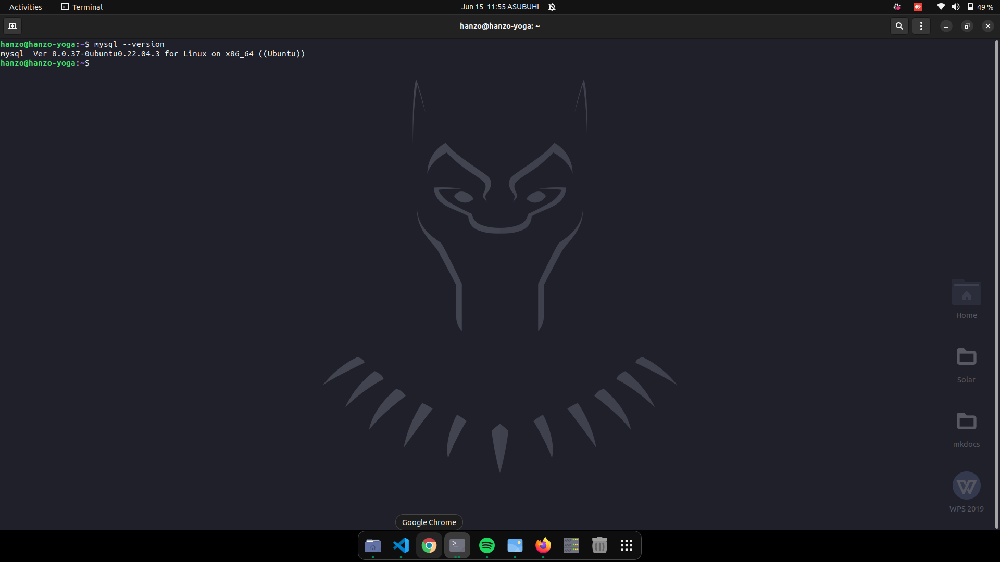

# Dev_Setup
Setup Development Environment

#Assignment: Setting Up Your Developer Environment

#Objective:
This assignment aims to familiarize you with the tools and configurations necessary to set up an efficient developer environment for software engineering projects. Completing this assignment will give you the skills required to set up a robust and productive workspace conducive to coding, debugging, version control, and collaboration.

#Tasks:
## Select Your Operating System (OS):
   **Ubuntu**
   I have already install ubuntu 24.04 LTS: The process I used
   1. 
   2. I selected the "Restart" menu tab and set "OS Optimized Defaults" to Disabled.
   3. Switching the “OS Optimized Defaults” settings may give a warning message. Select “Yes” to continue to disable OS Optimized Defaults.
   4.• Switching the “OS Optimized Defaults” settings may give a warning message. Select “Yes” to continue to disable OS Optimized Defaults.Select the “Startup” menu tab. Pressing F9 function key will allow Legacy and UEFI bootabledevices by setting “UEFI/Legacy Boot” to “Both”; otherwise, it will be an unchangeable setting to“UEFI only”.
   5. Press function F10 key to save and exit BIOS setup
   6. [I downloaded Ubuntu 24.04 LTS from the official site](https://ubuntu.com/download/desktop)
   7. Created a bootable USB drive using Rufus
   8. Booted from the USB drive and installed Ubuntu 24.04 LTS on my lenovo 360 yoga
   9. Configured the network settings and updated the system.
   10. Installed necessary packages like git, python, pip, etc.
   11. Configured the terminal with necessary plugins like zsh, oh-my-zsh.
   

## Install a Text Editor or Integrated Development Environment (IDE):
   
   **Visual Studio Code (VS Code)**
   1. I installed the snap package 
   2. I installed  Vs code using sudo snap install --classic code
   3. I checked  the version to check if vs code was installed succefully 

## Set Up Version Control System:
   **Install Git**
   1. First I updated my system using `sudo apt update `
   2. I installed Git using the command `sudo apt-get install git`

   **Configured Git**
   1.`git config --global user.name "peterjames3"`
   2. `git config --global user.email "email"`
   3. To verify my configuration I used `git config --list` 
   4. I created a github account [peterjames3]](https://github.com/peterjames3)
   5. Initialize a Git Repository Locally and  created a folder : ecommerce-product-page-main and cd inside the folder.
   6. I created a vite, tailwindcss and react project using `npm create vite@latest ecommerce -- --template react`
   7. I initialized a new Git repository using `git init` and added a remote repo, made my first commit, and pushed it to github using `git push -u origin master.
   8. [E-commerce](https://github.com/peterjames3/React-E-commerce)
   
## Install Necessary Programming Languages and Runtimes:
   For my case since I'm using ubuntu python by default came preinstalled, so I only needed to install virtual environment and django
     **Install Python Virtual Environment and django**

   1. I created a directory `mkdir DjangoProjectC` and cd into the dir 
     
     **Installing flutter**
   1. I visited their official website [flutter.dev/get-started](https://docs.flutter.dev/get-started/install).
   2. I went with linux since it's OS of choice
   3. I updated my system using `sudo apt-get update -y && sudo apt-get upgrade -y;`
   4. I downloaded flutter_linux_3.22.2-stable.tar.xz
   5. I extracted the file using `tar -xf ~/Downloads/flutter_linux_3.22.2-stable.tar.xz -C /usr/bin/`
   6. I added it to my path 
   7. To solve the issues I used various commands `sudo apt intall clang && apt install cmake && apt install ninja-build && apt install libgtk-3-dev`

## Install Package Managers:
   **If applicable, install package managers like pip (Python)**
   pip come pre-installed in linux 

   **node js**
   1. I installed nodejs using `sudo apt-get install nodejs`

## Configure a Database (MySQL):
  **Download and install MySQL database.** 
   1. To ensure the latest MYSQL version installation, I updated and upgraded the package repository using `sudo apt update && apt upgrade -y`
   2. I installed MYSQL using `sudo apt install mysql-server` and verify with `mysql --version`  
   3. To secure my installation I used `sudo mysql_secure_installation` command.
   4.  Users have three options for password policy:

    0 - low.
    1 - medium.
    2 - strong.

    Select one option and hit Enter. 
   5. Remove anonymous Users 
   6. 
   7. 
   8. Reload privileged Tables
   9.Check if mysql service is running using `MYSQL systemctl status mysql`
   10. Log in to MYSQL Server `sudo mysql -u root`
   11. I installed  mysqlworkbench ubuntu software 

## Set Up Development Environments and Virtualization (Optional):
   **installation of virtual machine**
   1. I used  .
   2. 

## Explore Extensions and Plugins:
   Upon launching VS Code, I was immediately impressed by the clean, modern interface. My first task was to personalize the environment to suit my preferences.
 - Using the Command Palette (Ctrl+Shift+P) to change the color theme was intuitive, allowing me to select a theme that was easy on my eyes.
 - Adjusting the font size and family through the settings (Ctrl+,) was equally simple, highlighting VS Code's user-centric design.
 - Installing essential extensions like     
      1. Prettier
      2. ESLint
      3. GitLens 
      4.Live Server 
 

